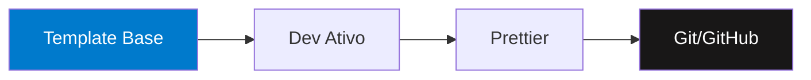

## 🚀 Sobre mim
- 🎓 Estudante de Desenvolvimento Web (Focado em consolidar fundamentos).
- 💡 Experiência prévia com lógica de programação, agora revisitando e aprofundando o ecossistema JavaScript.
- 🎯 Objetivo: Construir aplicações robustas e escaláveis.

## 🛠️ Tecnologias e Ferramentas

  
  
  
  
  
  
  
  

   
## 📊 GitHub Stats:
 
 

---

  
## 📈 No meu radar
- [X] HTML5 e CSS3 (Layouts Responsivos e Semântica)
- [ ] ⏳ Reforço de JavaScript Moderno (ES6+)
- [ ] Bibliotecas Front-end (React/Next.js)

## ⚙️ Meu Workflow de Desenvolvimento
Para garantir qualidade e velocidade nos meus estudos e futuros projetos, utilizo um ecossistema padronizado:

*“A persistência é o caminho do êxito.”*
