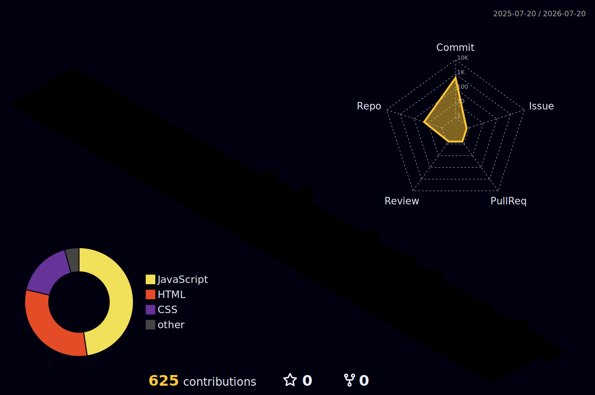

<a name="top"></a>

<!-- Header Animado -->
<div align="center">


</div>

<!-- Typing Effect Profissional -->
<div align="center">

<a href="https://git.io/typing-svg">
  
</a>

<br><br>

</div>

<!-- Social Badges -->
<div align="center">

<a href="https://www.linkedin.com/in/victormartinsd/">
  
</a>
<a href="https://github.com/VictorMartinsD">
  
</a>
<a href="https://victormartinsd.github.io/portfolio-dev/">
  
</a>

</div>
<br><br>

<!-- Contadores Profissionais -->
<div align="center">

[](https://wakatime.com/@9b6c8f48-1b50-43da-8c4a-c608e35762a8)


<br>
</div>

<!-- Menu de Navegação Rápida -->
<div align="center">

  <table align="center">
    <tr>
      <td align="center"><a href="#sobre"><kbd> <br> Sobre <br> </kbd></a></td>
      <td align="center"><a href="#toolbox"><kbd> <br> Toolbox <br> </kbd></a></td>
      <td align="center"><a href="#expertise"><kbd> <br> Skills <br> </kbd></a></td>
      <td align="center"><a href="#certificados"><kbd> <br> Diplomas <br> </kbd></a></td>
    </tr>
    <tr>
      <td align="center"><a href="#projetos"><kbd> <br> Projetos <br> </kbd></a></td>
      <td align="center"><a href="#stats"><kbd> <br> Stats <br> </kbd></a></td>
      <td align="center"><a href="#carreira"><kbd> <br> Carreira <br> </kbd></a></td>
      <td align="center"><a href="#contato"><kbd> <br> Contato <br> </kbd></a></td>
    </tr>
  </table>

</div>
<br>


<!-- Sobre Mim (Objeto JS) -->

<a name="sobre"></a>

## 👤 Sobre Mim

```javascript
const victor = {
  nome: "Victor Martins Dias",
  foco_atuação: "Desenvolvedor Web Frontend | JavaScript Enthusiast",

  objetivo_profissional: "Junior Web Developer",

  global_skills: {
    idioma: "Inglês (B1 - Intermediário)",
    competencias: ["Tradução", "Documentação Técnica", "Comunicação ESL"],
  },

  aprendendo_atualmente: [
    "Engenharia de Prompt & I.A. aplicada ao Dev",
    "Aprofundamento no Ecossistema JavaScript Moderno",
    "Metodologias de Produtividade & Clean Code",
  ],

  fun_fact: "Utilizando I.A. para otimizar o fluxo de desenvolvimento 🚀",
};
```

---

<!-- Toolbox e Tecnologias -->
<div align="center">
<a name="toolbox"></a>

## 🛠️ Toolbox & Tecnologias

### 👨‍💻 Desenvolvimento Core & Frontend

<table align="center">
  <tr>
    <td align="center" width="96">
      
      <br><sub>JavaScript</sub>
    </td>
    <td align="center" width="96">
      
      <br><sub>HTML5</sub>
    </td>
    <td align="center" width="96">
      
      <br><sub>CSS3</sub>
    </td>
    <td align="center" width="96">
      
      <br><sub>Prettier</sub>
    </td>
     <td align="center" width="96">
      
      <br><sub>Markdown</sub>
    </td>
  </tr>
</table>

### 🚀 Versionamento e Deploy

<p>
  
</p>

### 🛠️ Design & Ferramentas

<p>
  
</p>

### ⚙️ Suporte & Produtividade Extra

<p>
  
  
  
  
  
  
  
  
  
  
</p>

### 💡 Competências & Diferenciais

<p>
  
  
  
  
  
  
</p>

</div>

---

<!-- Roadmaps e Objetivos Futuros -->
<div align="center">

## 🎯 Próximos Objetivos de Estudo

_Mapeando a evolução para frameworks modernos e integração de dados._

  

<sub>Planejamento focado em <b>TypeScript</b>, <b>React</b> e fundamentos de <b>Backend</b> para expandir a capacidade de entrega no ecossistema JavaScript.</sub>

</div>

---

<!-- Gráfico de Skills e Proficiência -->
<div align="center">
<a name="expertise"></a>

## 📊 Expertise & Diferenciais

| Área de Atuação          |       Proficiência        | Aplicação Prática & Destaques                                                           |
| :----------------------- | :-----------------------: | :-------------------------------------------------------------------------------------- |
| **Desenvolvimento Web**  | ████████████████████░ 95% | **HTML5/CSS3:** Foco em semântica, estrutura e SEO.                                     |
| **Lógica & JavaScript**  | ██████████████████░░░ 85% | **ES6+:** Algoritmos eficientes, manipulação de DOM e escalabilidade.                   |
| **Design Responsivo**    | ██████████████████░░░ 85% | **UI/UX:** Interfaces adaptáveis (Mobile First) com Flexbox, Grid e Figma.              |
| **Inglês para Tech**     | ████████████████░░░░░ 75% | **Nível B1:** Leitura de documentação técnica, tradução e comunicação ESL.              |
| **Engenharia de Prompt** | ██████████████░░░░░░░ 70% | **I.A. Estratégica:** Otimização de fluxo de trabalho, debug e produtividade no código. |

<br>
</div>

---

<!-- Diplomas e Certificações (Galeria) -->
<div align="center">
<a name="certificados"></a>

## 🏆 Achievements & Certifications

  

</div>
<br>

<table align="center" border="0">
  <tr>
    <td align="center" valign="top" width="220">
      <a href="https://consultadiploma.estacio.br/diploma/163.163.1921d345a70e" target="_blank">
        <br>
        <sub><b>Barcharel em Sistemas de Informação</b><br>Estácio</sub>
      </a>
    </td>
    <td align="center" valign="top" width="220">
      <a href="https://app.rocketseat.com.br/certificates/4100a3ab-fa10-4b5d-b74d-0d7a7048d5f8" target="_blank">
        <br>
        <sub><b>Fundamentos de HTML e CSS</b><br>Rocketseat</sub>
      </a>
    </td>
    <td align="center" valign="top" width="220">
      <a href="https://app.rocketseat.com.br/certificates/241baee8-a9ea-4de8-930e-b0bac3ac25a3" target="_blank">
        <br>
        <sub><b>Inglês para Devs</b><br>Rocketseat</sub>
      </a>
    </td>
    <td align="center" valign="top" width="220">
      <a href="https://cert.efset.org/en/Qv7k7Y" target="_blank">
        <br>
        <sub><b>EF SET English</b><br>B1 Intermediate</sub>
      </a>
    </td>
  </tr>
</table>

<div align="center">
<details>
  <summary align="center"><b>📂 Clique para expandir outros certificados relevantes</b></summary>
  <br>
  <table align="center" border="0">
    <tr>
      <td align="center" valign="top" width="220">
        <a href="https://app.rocketseat.com.br/certificates/faf321bf-b930-4fb8-b876-98361bd1a4fa" target="_blank">
          <br>
          <sub><b>Engenharia de Prompt</b><br>Rocketseat</sub>
        </a>
      </td>
      <td align="center" valign="top" width="220">
        <a href="https://app.rocketseat.com.br/certificates/f868f4fd-6055-4e7f-b103-f195f8216f60" target="_blank">
          <br>
          <sub><b>Mentoria de Carreira</b><br>Rocketseat</sub>
        </a>
      </td>
      <td align="center" valign="top" width="220">
        <a href="https://www.linkedin.com/in/victormartinsd/overlay/Position/1312780318/treasury/?profileId=ACoAACUx_T0BZVBdW3GUllnwWrTOAiyfSyKC6Us" target="_blank">
          <br>
          <sub><b>Estágio de Nível Superior</b><br>Instituto Nacional do Seguro Social (INSS)</sub>
        </a>
      </td>
      <td align="center" valign="top" width="220">
        <a href="https://www.linkedin.com/in/victormartinsd/overlay/Certifications/1249209268/treasury/?profileId=ACoAACUx_T0BZVBdW3GUllnwWrTOAiyfSyKC6Us" target="_blank">
          <br>
          <sub><b>Técnico em Informática</b><br>Instituto Educacional Imaculada Conceição</sub>
        </a>
      </td>
    </tr>
  </table>
</details>
</div>

<div align="center">
  <br>
  <a href="https://www.linkedin.com/in/victormartinsd/details/certifications/" target="_blank">
    
  </a>
</div>

---

<!-- Projetos em Destaque -->
<div align="center">
<a name="projetos"></a>

## 🚀 Projetos em Destaque

<table width="100%">
  <tr>
    <td width="50%" valign="top">
      <h3>🎬 Viral Cutter</h3>
      <p><i>AI-Powered Video Analysis & Automation</i></p>
      
      
      
      
      
      
      
      <ul>
        <li>Integração com Google Gemini para análise de conteúdo.</li>
        <li>Processamento automatizado de vídeos com Cloudinary.</li>
        <li>Sistema de prompts reutilizáveis e tema claro/escuro.</li>
      </ul>
      <a href="https://github.com/VictorMartinsD/viral-cutter-ai"><b>Ver Repositório →</b></a>
    </td>
    <td width="50%" valign="top">
      <h3>✉️ Formulário de Convite</h3>
      <p><i>Interatividade & Manipulação de DOM</i></p>
      
      
      
      <ul>
        <li>Validação dinâmica e feedback visual.</li>
        <li>Foco total em UX e usabilidade.</li>
      </ul>
      <a href="https://github.com/VictorMartinsD/formulario-de-convite"><b>Ver Repositório →</b></a>
    </td>
  </tr>
  <tr>
    <td width="50%" valign="top">
        <h3>🎮 Catálogo Geek</h3>
        <p><i>Frontend & Organização de Conteúdo</i></p>
      
      
      
      <ul>
          <li>Layout responsivo com estética moderna.</li>
          <li>Estruturação de dados dinâmica.</li>
      </ul>
        <a href="https://github.com/VictorMartinsD/catalogo-geek"><b>Ver Repositório →</b></a>
    </td>
    <td width="50%" valign="top">
        <h3>📱 Rede Social</h3>
        <p><i>Prototipagem & Mobile First</i></p>
      
      
      
      <ul>
          <li>Design adaptável com Flexbox e Grid.</li>
          <li>Simulação de interface realística.</li>
      </ul>
        <a href="https://github.com/VictorMartinsD/rede-social"><b>Ver Repositório →</b></a>
    </td>
  </tr>
  <tr>
    <td width="50%" valign="top">
        <h3>🎨 Portfólio Dev</h3>
        <p><i>Showcase | Estrutura & Estilo</i></p>
      
      
      <ul>
          <li>Navegação semântica e legibilidade.</li>
          <li>Propriedades modernas de layout CSS.</li>
      </ul>
        <a href="https://github.com/VictorMartinsD/portfolio-dev"><b>Ver Repositório →</b></a>
    </td>
    <td width="50%" valign="top">
        <h3>🎙️ Zingen Landing Page</h3>
        <p><i>Design UI/UX & Landing Page</i></p>
      
      
      <ul>
          <li>Landing page de podcast com design moderno.</li>
          <li>Uso avançado de seletores e estilização CSS.</li>
      </ul>
        <a href="https://github.com/VictorMartinsD/zingen"><b>Ver Repositório →</b></a>
    </td>
  </tr>
</table>

<details>
  <summary><b>📂 Clique para expandir outros projetos relevantes</b></summary>
  <br>
  <table width="100%">
    <tr>
      <td width="50%" valign="top">
          <h3>🧪 JS Learning Lab</h3>
          <p><i>Lógica & Algoritmos com JavaScript</i></p>
        
        
        
        <ul>
            <li>Exercícios práticos de fundamentos da linguagem.</li>
            <li>Manipulação de elementos e lógica aplicada ao DOM.</li>
        </ul>
          <a href="https://github.com/VictorMartinsD/js-learning-lab"><b>Ver Repositório →</b></a>
      </td>
      <td width="50%" valign="top">
          <h3>📚 Encantos Literários</h3>
          <p><i>Motion Design & Interatividade</i></p>
        
        
        
        <ul>
            <li>Animações fluidas e Responsividade (Media Queries).</li>
            <li>Manipulação de classes via JS para estados de hover.</li>
        </ul>
          <a href="https://github.com/VictorMartinsD/encantos-literarios-motion"><b>Ver Repositório →</b></a>
      </td>
    </tr>
    <tr>
      <td width="50%" valign="top">
          <h3>🎧 Snitap Motion</h3>
          <p><i>Landing Page & CSS Animations</i></p>
        
        
        <ul>
            <li>Foco total em animações nativas de CSS.</li>
            <li>Layout moderno com transições de interface imersivas.</li>
        </ul>
          <a href="https://github.com/VictorMartinsD/snitap-motion-landing-page"><b>Ver Repositório →</b></a>
      </td>
      <td width="50%" valign="top">
          <h3>📝 Formulário de Matrícula</h3>
          <p><i>Estruturação de Dados & Acessibilidade</i></p>
        
        
        <ul>
            <li>Formulário complexo com foco em semântica HTML.</li>
            <li>Experiência de usuário (UX) aplicada a inputs.</li>
        </ul>
          <a href="https://github.com/VictorMartinsD/formulario-de-matricula"><b>Ver Repositório →</b></a>
      </td>
    </tr>
    <tr>
      <td width="50%" valign="top">
          <h3>📰 Portal de Notícias</h3>
          <p><i>CSS Nesting & Advanced Layout</i></p>
        
        
        <ul>
            <li>Uso de CSS Nesting, Grid e Flexbox.</li>
            <li>Arquitetura de conteúdo moderna e escalável.</li>
        </ul>
          <a href="https://github.com/VictorMartinsD/portal-de-noticias"><b>Ver Repositório →</b></a>
      </td>
      <td width="50%" valign="top">
          <h3>📸 Travelgram</h3>
          <p><i>Social Feed UI & Responsividade</i></p>
        
        
        <ul>
            <li>Interface de galeria de fotos estilo rede social.</li>
            <li>Design responsivo com foco em dispositivos móveis.</li>
        </ul>
          <a href="https://github.com/VictorMartinsD/projeto-travelgram"><b>Ver Repositório →</b></a>
      </td>
    </tr>
  </table>
</details>

</div>

<br>

<div align="center">
  <a href="https://github.com/VictorMartinsD?tab=repositories">
    
  </a>
</div>

---

<!-- Métricas e Gráficos de Atividade (APIs) -->

<a name="stats"></a>

<div align="center">

## 📊 Estatísticas e Atividade

### 🔥 Sequência de Commits

  <a href="https://github.com/DenverCoder1/github-readme-streak-stats">
    
  </a>

  <br/>

### 💻 Status do Perfil no GitHub

  <a href="https://github.com/anuraghazra/github-readme-stats">
    
  </a>
  <a href="https://github.com/anuraghazra/github-readme-stats">
    
  </a>

<p align="center">
  <br>
  <sub><b>Nota:</b> A seção de "Linguagens mais usadas" é uma métrica baseada em meus repositórios públicos, servindo como panorama estatístico e não como limitador de proficiência técnica.</sub>
</p>

  <br/>

  <a href="https://github.com/ashutosh00710/github-readme-activity-graph">
    
  </a>

### 📊 Atividade em 3D

[](https://github.com/VictorMartinsD)

</div>

---

<!-- Objetivos de Carreira (Bloco YAML) -->

<a name="carreira"></a>

<div align="center">

## 🎯 Aberto a Oportunidades

</div>
<br>
<table width="80%" border="0">
  <tr>
    <td width="60%" valign="top">

```yaml
buscando:
  - cargo: Desenvolvedor Web Júnior / Frontend (JavaScript)
  - tipo: Cargo Júnior
  - foco: Desenvolvimento Web, UI/UX, Engenharia de Prompt

interesses:
  - Desenvolvimento de interfaces modernas e responsivas
  - Automação e produtividade com I.A. (Engenharia de Prompt)
  - Projetos que demandem documentação ou comunicação em Inglês
  - Colaborações em ecossistema JavaScript Vanilla e ferramentas de Design

disponibilidade: Imediata
modelo_trabalho: [Remoto, Híbrido, Presencial]
```

   </td>
   <td width="40%" align="center" valign="middle">
     
   </td>
  </tr>
</table>

---

<!-- Canais de Contato e CTA -->

<a name="contato"></a>

<div align="center">
<h1>

</h1>

**Explore as diferentes camadas do meu desenvolvimento:**

<a href="https://www.linkedin.com/in/victormartinsd/">
  
</a>
<a href="https://github.com/VictorMartinsD">
  
</a>
<a href="https://victormartinsd.github.io/portfolio-dev/">
  
</a>
<br><br>

**📩 Email:** [victormartinsjob@gmail.com](mailto:victormartinsjob@gmail.com)
**📍 Disponível para trabalho: Remoto | Presencial | Híbrido**

</div>

<!-- Rodapé e Encerramento -->
<div align="center">


### "Linhas de código são invisíveis, mas o impacto que elas criam<br>na vida de quem as usa deve ser inesquecível."

<br>

<p align="right">
  <a href="#top">
    
  </a>
</p>


`🛠️ Arquitetado com rigor técnico e visão humana.`
<sub>**Ecossistema atualizado em Março de 2026.**</sub>

</div>
