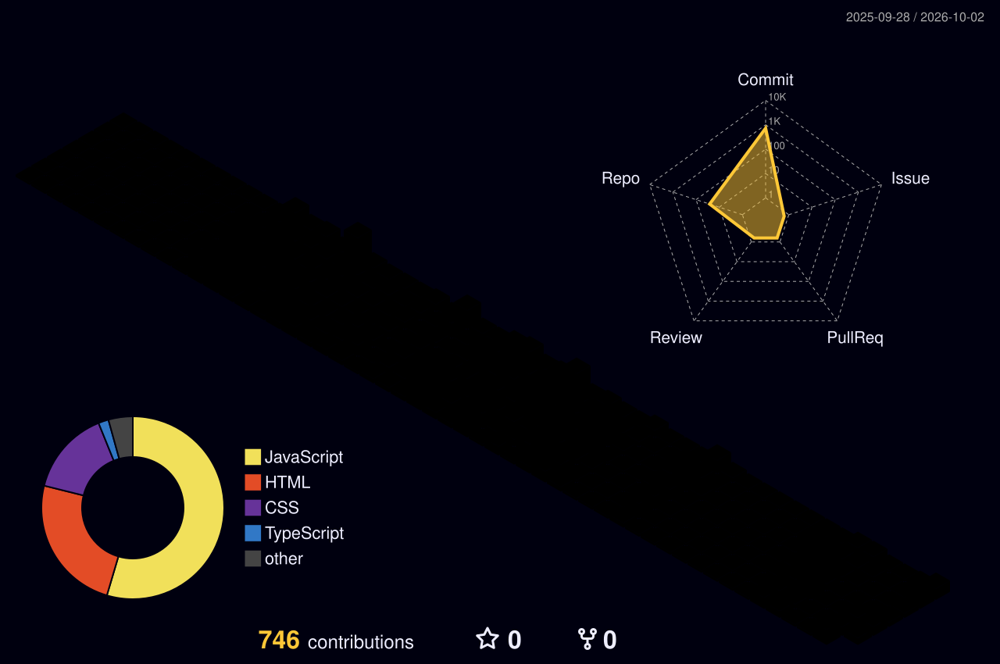

<a name="top"></a>

<!-- Header Animado -->
<div align="center">


</div>

<!-- Typing Effect Profissional -->
<div align="center">

<a href="https://git.io/typing-svg">
  
</a>

<br><br>

</div>

<!-- Social Badges -->
<div align="center">

<a href="https://www.linkedin.com/in/victormartinsd/">
  
</a>
<a href="https://github.com/VictorMartinsD">
  
</a>
<a href="https://victormartinsd.github.io/portfolio-dev/">
  
</a>

</div>
<br><br>

<!-- Contadores Profissionais -->
<div align="center">

[](https://wakatime.com/@9b6c8f48-1b50-43da-8c4a-c608e35762a8)


<br>
</div>

<!-- Menu de Navegação Rápida -->
<div align="center">

  <table align="center">
    <tr>
      <td align="center"><a href="#sobre"><kbd> <br> Sobre <br> </kbd></a></td>
      <td align="center"><a href="#toolbox"><kbd> <br> Toolbox <br> </kbd></a></td>
      <td align="center"><a href="#expertise"><kbd> <br> Skills <br> </kbd></a></td>
      <td align="center"><a href="#certificados"><kbd> <br> Certificados <br> </kbd></a></td>
    </tr>
    <tr>
      <td align="center"><a href="#projetos"><kbd> <br> Projetos <br> </kbd></a></td>
      <td align="center"><a href="#stats"><kbd> <br> Stats <br> </kbd></a></td>
      <td align="center"><a href="#carreira"><kbd> <br> Carreira <br> </kbd></a></td>
      <td align="center"><a href="#contato"><kbd> <br> Contato <br> </kbd></a></td>
    </tr>
  </table>

</div>
<br>


<!-- Sobre Mim (Objeto JS) -->

<a name="sobre"></a>

## 👤 Sobre Mim

> Sou formado em **Sistemas de Informação** e desenvolvedor web focado em **Frontend**. Gosto de entender o problema antes de construir a solução e aprendo na prática: estudo, crio projetos, testo e ajusto. Também olho para o produto além do código, priorizando a experiência do usuário e transformando necessidades em **requisitos claros**.

```javascript
const victor = {
  nome: "Victor Martins Dias",
  foco_atuação: "Desenvolvimento Web Frontend | Produto Digital",

  objetivo_profissional: "Criar e evoluir soluções web alinhadas às necessidades de usuários e produtos digitais",

  global_skills: {
    idioma: "Inglês (B1 - Intermediário geral: leitura, escrita, fala e escuta)",
    competencias: ["JavaScript ES6+ e lógica de programação", "HTML5 e CSS3", "Documentação técnica"],
  },

  aprendendo_atualmente: ["React", "Tailwind CSS"],
};
```

---

<!-- Toolbox e Tecnologias -->
<div align="center">
<a name="toolbox"></a>

## 🛠️ Toolbox & Tecnologias

### 👨‍💻 Desenvolvimento Core, Frontend & Backend

<table align="center">
  <tr>
    <td align="center" width="96" height="120" style="background-color:#1a2230; border:1px solid #2d394d; border-radius:10px; padding:12px 10px;">
      
      <br><sub>JavaScript</sub>
    </td>
    <td align="center" width="96" height="120" style="background-color:#1a2230; border:1px solid #2d394d; border-radius:10px; padding:12px 10px;">
      
      <br><sub>TypeScript</sub>
    </td>
    <td align="center" width="96" height="120" style="background-color:#1a2230; border:1px solid #2d394d; border-radius:10px; padding:12px 10px;">
      
      <br><sub>HTML5</sub>
    </td>
    <td align="center" width="96" height="120" style="background-color:#1a2230; border:1px solid #2d394d; border-radius:10px; padding:12px 10px;">
      
      <br><sub>CSS3</sub>
    </td>
    <td align="center" width="96" height="120" style="background-color:#1a2230; border:1px solid #2d394d; border-radius:10px; padding:12px 10px;">
      
      <br><sub>Vite</sub>
    </td>
    <td align="center" width="96" height="120" style="background-color:#1a2230; border:1px solid #2d394d; border-radius:10px; padding:12px 10px;">
      
      <br><sub>Node.js</sub>
    </td>
    <td align="center" width="96" height="120" style="background-color:#1a2230; border:1px solid #2d394d; border-radius:10px; padding:12px 10px;">
      
      <br><sub>Webpack</sub>
    </td>
    <td align="center" width="96" height="120" style="background-color:#1a2230; border:1px solid #2d394d; border-radius:10px; padding:12px 10px;">
      
      <br><sub>Markdown</sub>
    </td>
  </tr>
</table>

### 🌐 APIs, Dados & Qualidade

<table align="center">
  <tr>
    <td align="center" valign="middle" width="96" height="120" style="background-color:#1a2230; border:1px solid #2d394d; border-radius:10px; padding:12px 10px;">
      
      <br><sub>npm</sub>
    </td>
    <td align="center" valign="middle" width="96" height="120" style="background-color:#1a2230; border:1px solid #2d394d; border-radius:10px; padding:12px 10px;">
      
      <br><sub>Express.js</sub>
    </td>
    <td align="center" valign="middle" width="96" height="120" style="background-color:#1a2230; border:1px solid #2d394d; border-radius:10px; padding:12px 10px;">
      
      <br><sub>REST APIs</sub>
    </td>
    <td align="center" valign="middle" width="96" height="120" style="background-color:#1a2230; border:1px solid #2d394d; border-radius:10px; padding:12px 10px;">
      
      <br><sub>JSON</sub>
    </td>
    <td align="center" valign="middle" width="96" height="120" style="background-color:#1a2230; border:1px solid #2d394d; border-radius:10px; padding:12px 10px;">
      
      <br><sub>GitHub<br />Actions</sub>
    </td>
  </tr>
</table>

### 🔍 Tooling & Code Quality

<table align="center">
  <tr>
    <td align="center" width="96" height="120" style="background-color:#1a2230; border:1px solid #2d394d; border-radius:10px; padding:12px 10px;">
      
      <br><sub>ESLint</sub>
    </td>
    <td align="center" width="96" height="120" style="background-color:#1a2230; border:1px solid #2d394d; border-radius:10px; padding:12px 10px;">
      
      <br><sub>Prettier</sub>
    </td>
    <td align="center" width="96" height="120" style="background-color:#1a2230; border:1px solid #2d394d; border-radius:10px; padding:12px 10px;">
      
      <br><sub>Stylelint</sub>
    </td>
    <td align="center" width="96" height="120" style="background-color:#1a2230; border:1px solid #2d394d; border-radius:10px; padding:12px 10px;">
      
      <br><sub>Husky</sub>
    </td>
    <td align="center" width="96" height="120" style="background-color:#1a2230; border:1px solid #2d394d; border-radius:10px; padding:12px 10px;">
      
      <br><sub>Babel</sub>
    </td>
  </tr>
</table>

### 🚀 Versionamento e Deploy

<table align="center">
  <tr>
    <td align="center" width="96" height="120" style="background-color:#1a2230; border:1px solid #2d394d; border-radius:10px; padding:12px 10px;">
      
      <br><sub>Git</sub>
    </td>
    <td align="center" width="96" height="120" style="background-color:#1a2230; border:1px solid #2d394d; border-radius:10px; padding:12px 10px;">
      
      <br><sub>Github</sub>
    </td>
  </tr>
</table>

### 🧰 Ferramentas & Fluxo de Trabalho

<table align="center">
  <tr>
    <td align="center" width="96" height="120" style="background-color:#1a2230; border:1px solid #2d394d; border-radius:10px; padding:12px 10px;">
      
      <br><sub>VSCode</sub>
    </td>
    <td align="center" width="96" height="120" style="background-color:#1a2230; border:1px solid #2d394d; border-radius:10px; padding:12px 10px;">
      
      <br><sub>Figma</sub>
    </td>
    <td align="center" width="96" height="120" style="background-color:#1a2230; border:1px solid #2d394d; border-radius:10px; padding:12px 10px;">
      
      <br><sub>Notion</sub>
    </td>
  </tr>
</table>

### 📦 Ferramentas Complementares

<p>
  
  
  
  
  
  
  
</p>

### 💡 Competências Técnicas & Diferenciais

<p>
  
  
  
  
  
  
  
  
  
  
</p>

</div>

---

<!-- Aprendizado Atual e Roadmap de Desenvolvimento -->
<div align="center">

## 🧩 Aprendizado Atual

_Consolidando os fundamentos de React e Tailwind CSS para construir interfaces web modernas e interativas._

<table align="center">
  <tr>
    <td align="center" width="120">
      
      <br>React
    </td>
    <td align="center" width="120">
      
      <br>Tailwind CSS
    </td>
  </tr>
</table>

<sub>Em progresso: fundamentos de React, componentes, navegação e formulários, além de estilização com Tailwind CSS.</sub>

</div>

---

<!-- Roadmaps e Objetivos Futuros -->
<div align="center">

## 🎯 Próximos Objetivos de Estudo

_Ampliando a base fullstack com dados, infraestrutura e persistência._

<table align="center">
  <td align="center" width="96">
      
    <br>SQL
  </td>
  <td align="center" width="96">
      
    <br>MySQL
  </td>
  <td align="center" width="96">
      
    <br>Docker
  </td>
</table>

<sub>Próximos passos: SQL, MySQL, containers e fundamentos de infraestrutura para aplicações web.</sub>

</div>

---

<!-- Gráfico de Skills e Proficiência -->
<div align="center">
<a name="expertise"></a>

## 📊 Expertise & Diferenciais

| Área de Atuação          | Aplicação Prática & Destaques                                                            |
| :----------------------- | :--------------------------------------------------------------------------------------- |
| **Desenvolvimento Web**  | **HTML5/CSS3:** Semântica, estrutura, responsividade e SEO.                              |
| **Lógica & JavaScript**  | **ES6+:** Lógica, algoritmos, DOM e organização de código em módulos.                    |
| **Design Responsivo**    | **UI/UX:** Interfaces adaptáveis com Flexbox, Grid e conversão de protótipos do Figma.   |
| **APIs & Backend**       | **Node.js:** APIs HTTP/REST, JSON, rotas, middlewares e persistência em arquivos.        |
| **Qualidade de Código**  | **ESLint, Prettier e Husky:** Linting, formatação e automação de tarefas do projeto.     |
| **Engenharia de Prompt** | Uso crítico de IA para pesquisa, debug, documentação e produtividade no desenvolvimento. |

<br>
</div>

---

<!-- Experiência Complementar em Produto -->
<div align="center">
<a name="produto"></a>

## 🧭 Experiência Complementar em Produto

<sub>Práticas e iniciativas voltadas a Product Management, Documentação Técnica e Organização de Demandas</sub>

<br />

<table align="center" width="100%">
  <tr>
    <td width="50%" valign="top" style="background-color:#1a2230; border:1px solid #2d394d; border-radius:10px; padding:16px;">
      <h4>📋 Documentação de Produto & Specs</h4>
      <p>Elaboração de documentação detalhada para projetos (Visão, Requisitos, Regras de Negócio, Fluxo do Usuário, MVP e Métricas).</p>
      <a href="https://github.com/VictorMartinsD/refund-dashboard/blob/master/docs/PRODUCT_SPEC.md">👉 <b>Ver Product Spec do Refund Dashboard</b></a>
    </td>
    <td width="50%" valign="top" style="background-color:#1a2230; border:1px solid #2d394d; border-radius:10px; padding:16px;">
      <h4>🎯 Discovery, Requisitos & backlog</h4>
      <p>Transformação de dores e necessidades dos usuários em requisitos técnicos bem definidos e tarefas acionáveis de desenvolvimento.</p>
    </td>
  </tr>
  <tr>
    <td width="50%" valign="top" style="background-color:#1a2230; border:1px solid #2d394d; border-radius:10px; padding:16px;">
      <h4>👥 Gestão de Comunidade & Priorização</h4>
      <p>Organização, triagem e priorização de demandas em comunidade digital ativa com centenas de usuários.</p>
    </td>
    <td width="50%" valign="top" style="background-color:#1a2230; border:1px solid #2d394d; border-radius:10px; padding:16px;">
      <h4>🌱 Liderança & Capacitação</h4>
      <p>Coordenação de iniciativas voltadas ao ensino de lógica e organização estruturada de equipes.</p>
    </td>
  </tr>
</table>

</div>

---

<!-- Diplomas e Certificações -->
<div align="center">
<a name="certificados"></a>

## 🏆 Conquistas & Certificações

  

</div>
<br>

<table align="center" border="0">
  <tr>
    <td align="center" valign="top" width="220">
      <a href="https://app.rocketseat.com.br/certificates/52a1eaf1-44d1-4e24-8f85-9aa8c68cff43" target="_blank">
        <br>
        <sub><b>JavaScript</b><br>Rocketseat</sub>
      </a>
    </td>
    <td align="center" valign="top" width="220">
      <a href="https://consultadiploma.estacio.br/diploma/163.163.1921d345a70e" target="_blank">
        <br>
        <sub><b>Bacharel em Sistemas de Informação</b><br>Estácio</sub>
      </a>
    </td>
    <td align="center" valign="top" width="220">
      <a href="https://app.rocketseat.com.br/certificates/4100a3ab-fa10-4b5d-b74d-0d7a7048d5f8" target="_blank">
        <br>
        <sub><b>HTML e CSS</b><br>Rocketseat</sub>
      </a>
    </td>
    <td align="center" valign="top" width="220">
      <a href="https://app.rocketseat.com.br/certificates/241baee8-a9ea-4de8-930e-b0bac3ac25a3" target="_blank">
        <br>
        <sub><b>Inglês para Devs</b><br>Rocketseat</sub>
      </a>
    </td>
  </tr>
</table>

<div align="center">
<details>
  <summary align="center"><b>📂 Clique para expandir outros certificados relevantes</b></summary>
  <br>
  <table align="center" border="0">
    <tr>
      <td align="center" valign="top" width="220">
        <a href="https://cert.efset.org/en/Qv7k7Y" target="_blank">
          <br>
          <sub><b>EF SET English</b><br>B1 Intermediate</sub>
        </a>
      </td>
      <td align="center" valign="top" width="220">
        <a href="https://app.rocketseat.com.br/certificates/faf321bf-b930-4fb8-b876-98361bd1a4fa" target="_blank">
          <br>
          <sub><b>Engenharia de Prompt</b><br>Rocketseat</sub>
        </a>
      </td>
      <td align="center" valign="top" width="220">
        <a href="https://app.rocketseat.com.br/certificates/f868f4fd-6055-4e7f-b103-f195f8216f60" target="_blank">
          <br>
          <sub><b>Mentoria de Carreira</b><br>Rocketseat</sub>
        </a>
      </td>
      <td align="center" valign="top" width="220">
        <a href="https://www.linkedin.com/in/victormartinsd/overlay/Position/1312780318/treasury/?profileId=ACoAACUx_T0BZVBdW3GUllnwWrTOAiyfSyKC6Us" target="_blank">
          <br>
          <sub><b>Estágio de Nível Superior</b><br>Instituto Nacional do Seguro Social (INSS)</sub>
        </a>
      </td>
    </tr>
  </table>
</details>
</div>

<div align="center">
  <br>
  <a href="https://www.linkedin.com/in/victormartinsd/details/certifications/" target="_blank">
    
  </a>
</div>

---

<!-- Projetos em Destaque -->
<div align="center">
<a name="projetos"></a>

## 🚀 Projetos em Destaque

<table width="100%">
  <tr>
    <td width="50%" valign="top">
      <h3>🎬 Viral Cutter</h3>
      <p><i>AI-Powered Video Analysis & Automation</i></p>
      
      
      
      
      
      
      
      
      <ul>
        <li>Integração cliente <code>Cloudinary + Gemini</code> para extração automática de clipes (sem backend).</li>
        <li>Polling robusto com feedback de status em tempo real.</li>
        <li>CRUD de prompts e perfis em <code>localStorage</code> com arquitetura modular ES6.</li>
        <li><a href="https://pt.linkedin.com/posts/victormartinsd_desenvolvimentoweb-javascript-rocketseat-activity-7447750117945888768-SJ7r?utm_source=li_share&utm_content=feedcontent&utm_medium=g_dt_web&utm_campaign=copy">Apresentação em vídeo no LinkedIn</a>, demonstrando a comunicação do projeto e seus principais fluxos.</li>
      </ul>
      <br>
      <a href="https://github.com/VictorMartinsD/viral-cutter-ai"></a>&nbsp;&nbsp;&nbsp;
      <a href="https://victormartinsd.github.io/viral-cutter-ai/"></a>
    </td>
    <td width="50%" valign="top">
      <h3>🔌 Product Catalog API</h3>
      <p><i>API REST para validação de produtos com Node.js e TypeScript</i></p>
      
      
      
      
      <ul>
        <li>API REST modular com <code>Node.js</code>, <code>TypeScript</code> e <code>Express</code>.</li>
        <li>Validação de produtos com <code>Zod</code> e regras de entrada tipadas.</li>
        <li>Rotas, middleware e tratamento centralizado de erros HTTP.</li>
      </ul>
      <br>
      <a href="https://github.com/VictorMartinsD/product-catalog-api"></a>
    </td>
  </tr>
  <tr>
    <td width="50%" valign="top">
      <h3>🛒 Quicklist App</h3>
      <p><i>Gerenciador de Listas de Compras Inteligente</i></p>
      
      
      
      
      
      <ul>
        <li>Gerenciamento de estado centralizado com persistência e versionamento em <code>localStorage</code>.</li>
        <li>Interface responsiva com tema claro/escuro, organização por categorias e importação/exportação.</li>
        <li>Arquitetura modular ES6 escalável.</li>
      </ul>
      <br>
      <a href="https://github.com/VictorMartinsD/quicklist-app"></a>&nbsp;&nbsp;&nbsp;
      <a href="https://victormartinsd.github.io/quicklist-app/"></a>
    </td>
    <td width="50%" valign="top">
      <h3>🎫 Support Tickets</h3>
      <p><i>API de tickets de suporte com Node.js nativo</i></p>
      
      
      
      <ul>
        <li>API HTTP modular com <code>Node.js</code> nativo e rotas dinâmicas.</li>
        <li>CRUD de tickets com estados <code>open</code>/<code>closed</code>.</li>
        <li>Persistência JSON com controllers, middlewares e utilitários separados.</li>
      </ul>
      <br>
      <a href="https://github.com/VictorMartinsD/support-tickets"></a>
    </td>
  </tr>
  <tr>
    <td width="50%" valign="top">
      <h3>🧾 Refund Dashboard</h3>
      <p><i>Controle local de despesas corporativas e totalizadores de reembolso</i></p>
      
      
      
      
      
      <ul>
        <li>Registro de despesas com validação e formatação de moeda em <code>BRL</code>.</li>
        <li>Persistência local em <code>localStorage</code> e UI sem backend.</li>
        <li>Alternância de tema com preferência do usuário e recuperação automática.</li>
      </ul>
      <br>
      <a href="https://github.com/VictorMartinsD/refund-dashboard"></a>&nbsp;&nbsp;&nbsp;
      <a href="https://victormartinsd.github.io/refund-dashboard/"></a>
    </td>
    <td width="50%" valign="top">
      <h3>💱 Convert Money</h3>
      <p><i>Conversor de Moedas em Tempo Real</i></p>
      
      
      
      
      
      
      <ul>
        <li>Testes unitários com <code>Vitest</code> para normalização, parsing e precisão.</li>
        <li>Arquitetura resiliente com <code>ExchangeRate API</code> e fallback offline.</li>
        <li>Pipeline de qualidade integrado: <code>Vite, ESLint, Prettier, Husky</code> e <code>GitHub Actions</code>.</li>
      </ul>
      <br>
      <a href="https://github.com/VictorMartinsD/convert-money"></a>&nbsp;&nbsp;&nbsp;
      <a href="https://victormartinsd.github.io/convert-money/"></a>
    </td>
  </tr>
</table>

<details>
  <summary><b>📂 Clique para expandir outros projetos relevantes</b></summary>
  <br>
  <table width="100%">
    <tr>
      <td width="50%" valign="top">
        <h3>✂ Hair Day</h3>
        <p><i>Agenda diária com reservas, cancelamento e horários.</i></p>
        
        
        
        
        
        
        <ul>
          <li>Seleção de data e horários disponíveis com regras de agenda em tempo real.</li>
          <li>Criação e cancelamento de compromissos com atualização imediata.</li>
          <li>Arquitetura modular com <code>JavaScript</code>, <code>Webpack</code> e <code>Babel</code>.</li>
        </ul>
        <br>
        <a href="https://github.com/VictorMartinsD/hairday"></a>&nbsp;&nbsp;&nbsp;
        <a href="https://victormartinsd.github.io/hairday/"></a>
      </td>
      <td width="50%" valign="top">
        <h3>🎲 Numbers Raffle</h3>
        <p><i>Sorteio de Números com Validação e Regras Configuráveis</i></p>
        
        
        
        
        <ul>
          <li>Geração de números com intervalo configurável e repetição controlada.</li>
          <li>Validação de entradas e unicidade garantida com <code>Set</code>.</li>
          <li>Fluxo acessível com <code>aria-live</code>, foco gerenciado e animações.</li>
        </ul>
        <br>
        <a href="https://github.com/VictorMartinsD/numbers-raffle"></a>&nbsp;&nbsp;&nbsp;
        <a href="https://victormartinsd.github.io/numbers-raffle/"></a>
      </td>
    </tr>
    <tr>
      <td width="50%" valign="top">
        <h3>✉️ Formulário de Convite</h3>
        <p><i>Interatividade & Manipulação de DOM</i></p>
        
        
        
        
      <ul>
        <li>Máscara de telefone inteligente diferenciando celular e fixo com persistência automática.</li>
        <li>Validação visual em tempo real com feedback dinâmico e ícones <code>SVG</code>.</li>
        <li>Auto-save de inputs com restauração ao carregar e otimização social (<code>Open Graph</code>).</li>
      </ul>
      <br>
      <a href="https://github.com/VictorMartinsD/formulario-de-convite"></a>&nbsp;&nbsp;&nbsp;
      <a href="https://victormartinsd.github.io/formulario-de-convite/"></a>
    </td>
    <td width="50%" valign="top">
      <h3>📚 Encantos Literários</h3>
      <p><i>Motion Design & Interatividade</i></p>
      
      
      
      <ul>
        <li>Tipografia fluida com <code>clamp()</code> e Design System CSS Variables para responsividade automática.</li>
        <li>Animações CSS 3D com transformações sincronizadas em keyframes.</li>
        <li>SVG backgrounds com gradientes radiais e depth visual via pseudoelementos.</li>
      </ul>
      <br>
      <a href="https://github.com/VictorMartinsD/encantos-literarios-motion"></a>&nbsp;&nbsp;&nbsp;
      <a href="https://victormartinsd.github.io/encantos-literarios-motion/"></a>
    </td>
  </tr>
  <tr>
    <td width="50%" valign="top">
      <h3>🎮 Catálogo Geek</h3>
      <p><i>Frontend & Organização de Conteúdo</i></p>
      
      
      
      <ul>
        <li>Catálogo dinâmico montado em tempo real com criação de cards no <code>DOM</code>.</li>
        <li>Separação automática por categoria e vitrines horizontais com navegação fluida.</li>
        <li>Interface responsiva com cards padronizados e interatividade em <code>hover</code>.</li>
      </ul>
      <br>
      <a href="https://github.com/VictorMartinsD/catalogo-geek"></a>&nbsp;&nbsp;&nbsp;
      <a href="https://victormartinsd.github.io/catalogo-geek/"></a>
    </td>
    <td width="50%" valign="top">
      <h3>📱 Rede Social</h3>
      <p><i>Prototipagem & Mobile First</i></p>
      
      
      
      <ul>
        <li>Uso de <code>&lt;dialog&gt;</code> nativo para modal de posts sem dependências.</li>
        <li>Interatividade dinâmica: botões de seguir com estado visual e curtidas com contador em tempo real.</li>
        <li>Conteúdo centralizado em <code>database.js</code> para manutenção escalável.</li>
      </ul>
      <br>
      <a href="https://github.com/VictorMartinsD/rede-social"></a>&nbsp;&nbsp;&nbsp;
      <a href="https://victormartinsd.github.io/rede-social/"></a>
    </td>
  </tr>
</table>
</details>

</div>

---

<!-- Métricas e Gráficos de Atividade (APIs) -->

<a name="stats"></a>

<div align="center">

## 📊 Estatísticas e Atividade

### 🔥 Sequência de Commits

  <a href="https://github.com/DenverCoder1/github-readme-streak-stats">
    
  </a>

  <br/>

### 💻 Status do Perfil no GitHub

  <a href="https://github.com/anuraghazra/github-readme-stats">
    
  </a>

  <br>

  <a href="https://github.com/anuraghazra/github-readme-stats">
    
  </a>

<p align="center">
  <br>
  <sub><b>Nota:</b> A seção de "Linguagens mais usadas" é uma métrica baseada em meus repositórios públicos, servindo como panorama estatístico e não como limitador de proficiência técnica.</sub>
</p>

### 📊 Atividade em 3D

[](https://github.com/VictorMartinsD)

</div>

---

<!-- Objetivos de Carreira (Bloco YAML) -->

<a name="carreira"></a>

<div align="center">

## 🎯 Aberto a Oportunidades

</div>
<br>
<table width="80%" border="0">
  <tr>
    <td width="60%" valign="top">

```yaml
buscando:
  - cargo: Desenvolvedor Web / Frontend (JavaScript)
  - tipo: Trainee ou Cargo Júnior
  - foco: Desenvolvimento Web e Produto

interesses:
  - Desenvolvimento de interfaces modernas, responsivas e fiéis ao Figma
  - Conexão entre desenvolvimento frontend, requisitos e visão de produto
  - Integração entre interfaces, APIs, bancos de dados e serviços web
  - Qualidade de software e testes
  - IA e automação aplicadas ao desenvolvimento
  - Documentação técnica e comunicação em inglês

disponibilidade: Imediata
modelo_trabalho: Remoto, Híbrido ou Presencial
```

   </td>
   <td width="40%" align="center" valign="middle">
     
   </td>
  </tr>
</table>

---

<!-- Canais de Contato e CTA -->

<a name="contato"></a>

<div align="center">
<h1>

</h1>

**Explore as diferentes camadas do meu desenvolvimento:**

<a href="https://www.linkedin.com/in/victormartinsd/">
  
</a>
<a href="https://github.com/VictorMartinsD">
  
</a>
<a href="https://victormartinsd.github.io/portfolio-dev/">
  
</a>
<br><br>

**📩 Email:** [victormartinsjob@gmail.com](mailto:victormartinsjob@gmail.com)

</div>

<!-- Rodapé e Encerramento -->
<div align="center">


### "Linhas de código são invisíveis, mas o impacto que elas criam<br>na vida de quem as usa deve ser inesquecível."

<br>

<p align="right">
  <a href="#top">
    
  </a>
</p>


`🛠️ Construído com curiosidade, prática e foco em quem usa.`


</div>
